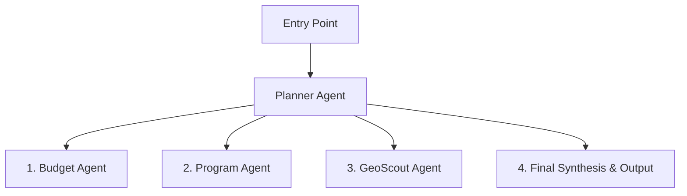

# Homebuyer MVP: Core Flow

_Multi-agent homebuyer assistance system with financial analysis and neighborhood matching._  
**Disclaimer: This project is for educational purposes only. It does not provide financial advice.**

---

## The Challenge

```text
"By the age of 30, only about 42 percent of millennials owned a home. That compares to 48 percent of Generation X and 51 percent of Baby Boomers."
The American Dream of homeownership feels increasingly out of reach. First-time buyers face mounting challenges: crushing debt loads, skyrocketing housing costs, and a maze of confusing assistance programs they don't even know exist.
MAREA (Multi-Agent Real Estate Assistant) is designed specifically for first-time homebuyers who need clear, actionable guidance to navigate the complex path to homeownership. Our multi-agent system cuts through the confusion by analyzing your financial readiness, identifying affordable neighborhoods, and matching you with assistance programs you actually qualify for.
```

---

## Architecture Overview

This project follows a **multi-agent pipeline architecture** built with LangGraph and MCP (Model Context Protocol).

- **Specialized agents** working with external data sources via MCP
- **MCP servers** providing real-time financial and property data
- **LangGraph workflows** orchestrating agent interactions
- **Docker containerization** for scalable deployment
- **Budgeting-focused MVP** with property analysis capabilities

---

## Agent Pipeline

The system consists of a **Planner Agent** that orchestrates specialized agents:

- **Planner Agent** – orchestrates the sequential workflow and synthesizes final recommendations
- **Budgeting Agent** – calculates housing affordability and provides budget recommendations
- **Program Agent** – identifies eligible assistance programs and loans
- **Geo-Scout Agent** – finds neighborhoods within budget, evaluates quality of life

---

## Core Workflow

The Planner Agent orchestrates a sequential workflow through specialized agents:



### Sequential Orchestration

1. **Budgeting Agent** - Calculates housing affordability and budget recommendations
2. **Program Agent** - Identifies eligible assistance programs and loans
3. **Geo-Scout Agent** - Finds neighborhoods within budget and evaluates quality of life
4. **Synthesis** - Combines all outputs into actionable user recommendations

### Evaluation, Validation, Telemetry

Each step includes validation, error handling, and performance monitoring to ensure reliable operation.

---

## Agent Specifications

### Planner Agent

**Role:** Orchestrates the sequential workflow and synthesizes final recommendations  
**Input:** User financial profile, preferences, and goals  
**Output:** Comprehensive homebuying plan with actionable recommendations  
**Workflow:**

1. Calls Budgeting Agent to establish financial foundation
2. Calls Program Agent to identify assistance opportunities
3. Calls Geo-Scout Agent to find suitable neighborhoods
4. Synthesizes all outputs into cohesive user-facing recommendations
   **Integration:** Coordinates with all specialized agents via LangGraph workflows

### Budgeting Agent

**Input:** User income, financial goals  
**Output:** `{budget_amount, budget_percentage, recommendations}`  
**Rule:** Housing budget = 30% of gross income  
**MCP Integration:** Finance server for budget calculations

### Program Agent

**Input:** Location, income vs AMI, buyer status  
**Output:** `[{name, eligibility, benefit}]`  
**Rule:** Must match profile, no hallucinated programs  
**Cache:** Programs by AMI bracket + state

### Geo-Scout Agent

**Input:** Budget from Budgeting Agent, target city, user priorities  
**Output:** `[{zip, median_home_value, school_rating, transit_score, safety_index}]`  
**Rule:** All median home values ≤ Budgeting Agent's max  
**Cache:** Median home values per ZIP

---

## Repository Structure

This repository is organized to support **containerized agents** and **MCP servers**.

```text
.
├── README.md
├── gradio_app.py            # Main web application (FastAPI + Gradio)
├── docker-compose.yml       # Multi-container orchestration
├── Dockerfile               # Main application container
├── Makefile                 # Build and run commands
├── pyproject.toml           # Python dependencies
├── poetry.lock              # Locked dependency versions
│
├── agents/                  # LangGraph agent implementations
│   ├── budgeting_agent/       # Budget calculation and recommendations
│   │   ├── graph.py             # LangGraph workflow definition
│   │   ├── nodes.py             # Individual workflow nodes
│   │   ├── prompts.py           # LLM prompts and templates
│   │   └── state.py             # State management
│   ├── planner_agent/       # Orchestrator agent
│   │   ├── graph.py
│   │   ├── nodes.py
│   │   ├── prompts.py
│   │   └── state.py
│   ├── geoscout_agent/      # Neighborhood discovery
│   │   ├── graph.py
│   │   ├── nodes.py
│   │   ├── prompts.py
│   │   └── state.py
│   └── program_agent/       # Assistance program matching
│       ├── graph.py
│       ├── nodes.py
│       ├── prompts.py
│       └── state.py
│
├── mcp_kit/                 # MCP toolkit components
│   ├── __init__.py
│   ├── adapter.py             # MCP adapter for service integration
│   ├── tools.py               # LangChain tools for MCP services
│   ├── README.md              # MCP kit documentation
│   ├── servers/               # MCP server implementations
│   │   ├── finance/             # Finance calculation server
│   │   │   ├── Dockerfile
│   │   │   └── server.py
│   │   ├── location/            # Location services server
│   │   │   ├── Dockerfile
│   │   │   └── server.py
│   │   └── supabase/            # Property data server
│   │       └── Dockerfile
│   └── clients/               # MCP client implementations
│       ├── __init__.py
│       ├── finance_client.py
│       ├── location_client.py
│       └── supabase_client.py
│
├── tests/                   # Test suite
│   ├── __init__.py
│   ├── test_langsmith.py
│   ├── test_location_transit.py
│   ├── test_tools.py
│   └── test_vector_query.py
├── utils/                   # Test suite
│   ├── convenience.py
│   ├── embedder.py
│   ├── ny_programs.json
│   └── token_tracking.py
└── web_server/              # Test suite
    ├── css.txt
    ├── gr_interface.py
    ├── server.py
```

---

## Quick Start

### 1. Environment Setup

Create a `.env` file with your API keys:

```bash
OPENAI_API_KEY=your_openai_api_key_here
GOOGLE_API_KEY=your_google_api_key_here
SUPABASE_URL=your_supabase_url_here
SUPABASE_KEY=your_supabase_anon_key_here
...
```

### 2. Start the Application

```bash
# Start all services
make start

# Or manually
docker compose up --build -d
```

### 3. Access the Interface

- **Web Interface**: http://localhost:8000
- **API Documentation**: http://localhost:8000/docs

### 4. Stop Services

```bash
make stop
```

---

## Available Commands

| Command             | Description             |
| ------------------- | ----------------------- |
| `make start`        | Start MAREA application |
| `make stop`         | Stop MAREA application  |
| `make logs`         | Show container logs     |
| `make test-planner` | Run planner agent test  |
| `make clean`        | Clean up files          |

---

## Web Interface

The system provides a modern web interface built with **FastAPI + Gradio**:

- **Input Form**: Enter income, credit score, target home ID, and zip code
- **Real-time Analysis**: Get instant financial analysis and recommendations
- **API Access**: RESTful API for programmatic integration
- **Example Data**: Pre-loaded examples for quick testing

### API Endpoints

- `POST /analyze` - Analyze user financial profile
- `GET /docs` - API documentation

---

## MCP Architecture

The system uses **Model Context Protocol (MCP)** to connect agents with external data sources:

- **MCP Adapter**: Central coordinator managing connections to all MCP servers
- **Finance MCP Server**: Provides budget calculations and financial analysis
- **Supabase MCP Server**: Supplies property data and neighborhood information
- **LangChain Tools**: Bridge between agents and MCP services

### Key Components

- `mcp_kit/adapter.py` - MCP connection management
- `mcp_kit/tools.py` - LangChain tools for MCP integration
- `mcp_kit/servers/` - Individual MCP server implementations
- `mcp_kit/clients/` - MCP client wrappers

---

## Environment Setup

Create a `.env` file in the project root with the following required keys:

```bash
# OpenAI API Key (required for LLM functionality)
OPENAI_API_KEY=your_openai_api_key_here
OPENAI_MODEL=gpt-4o-mini

# Gemini API Key (required for LLM functionality)
GOOGLE_API_KEY=your_google_api_key_here
GEMINI_MODEL=gemini-2.5-flash

# Supabase Configuration (required for property data)
SUPABASE_URL=your_supabase_url_here
SUPABASE_KEY=your_supabase_anon_key_here

# LangSmith Configuration (optional, for monitoring)
LANGSMITH_API_KEY=your_langsmith_api_key_here
LANGSMITH_TRACING=true
LANGSMITH_PROJECT=civic-assistant-team-5

# Walkscore variables
WALKSCORE_API_KEY=your_walkscore_api
WALKSCORE_BASE_URL=https://api.walkscore.com/score

# Supabase variables
POSTGRES_DB=postgres
POSTGRES_USER=postgres
POSTGRES_PASSWORD=password
POSTGRES_HOST=host
POSTGRES_PORT=port
DATABASE_URL=db_url
SUPABASE_ACCESS_TOKEN=your_supabase_token
SUPABASE_PROJECT_REF=your_supabase_project_ref
READONLY_DATABASE_URL=ro_db_url
```

---

## Development Principles

- **Sequential agent processing** with clear handoffs
- **Deterministic calculations** where possible (credit scores, ratios)
- **Comprehensive caching** for performance
- **Validation checks** prevent incomplete/not-allowed user input fields

---

## Future Phases

- [ ] Direct listing integration (Rentcast APIs)
- [ ] "Ready to buy" vs "browsing" user workflows
- [ ] Real-time program eligibility updates
- [ ] Enhanced neighborhood scoring algorithms
- [ ] Additional test cases
