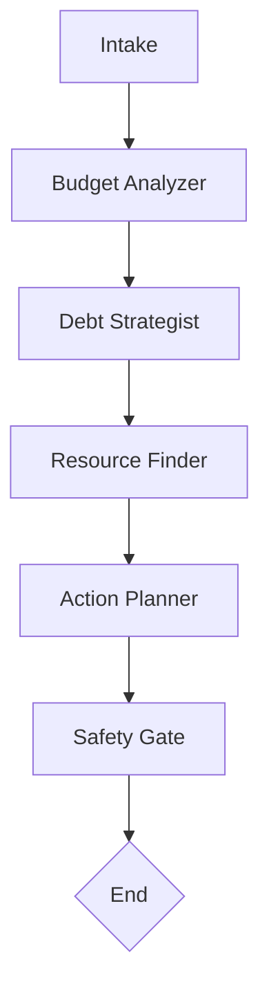

# Civic AI: Debt & Budget Assistant

_Educational multi-agent assistant built with LangGraph and MCP._  
⚠️ **Disclaimer: This project is for educational purposes only. It does not provide financial advice.**

---

## Architecture Overview

This project follows a **containerized multi-agent architecture**.

- **One agent = one container** (LangGraph workflow)
- **One MCP server = one container** (tool provider)
- Agents communicate through **A2A structured messages**
- Tools are invoked through **MCP (Model Context Protocol)**
- Deployment is orchestrated via **Docker Compose**

---

## Agents Planned

Each agent has a clear role and limited scope:

- **Intake Agent** – gathers initial user input and context
- **Budget Analyzer** – classifies income/expenses, computes savings rates
- **Debt Strategist** – compares payoff strategies (e.g., snowball vs avalanche)
- **Resource Finder** – looks up nonprofit, government, or housing programs
- **Action Planner** – generates neutral scripts/plans (e.g., creditor calls)
- **Safety Gate** – enforces disclaimers, checks outputs for compliance

---

## MCP Tools (Planned)

Each tool is hosted in its **own containerized MCP server**.

- `apr_calc` – compute payoff timelines given balance, APR, and payments
- `spend_classifier` – categorize expenses into buckets (housing, food, etc.)
- `resource_lookup` – retrieve structured info on nonprofit/gov programs

---

## LangGraph Workflow



---

## Repository Structure

This repository is organized to support **containerized agents** and **MCP servers**.

```text
.
├── README.md
├── CONTRIBUTING.md
├── creds.env
├── .gitignore
├── requirements.txt
├── docker-compose.yml
├── pyproject.toml
├── poetry.lock
│
├── main.py                  # Entrypoint for agent container
├── Dockerfile               # Agent container build
│
├── agents/                  # LangGraph agent implementations
│   └── agent_name/
│       ├── __init__.py
│       ├── graph.py
│       ├── nodes.py
│       ├── prompts.py
│       ├── router.py
│       └── state.py
│
├── mcp_services/            # One subdir = one MCP server container
│   ├── client.py            # MCP client for agent
│   └── servers/
│       └── server_name/
│           ├── __init__.py
│           ├── server.py    # MCP tool definitions
│           ├── Dockerfile   # Container spec for this MCP server
│           └── requirements.txt
│
├── tests/                   # Pytest-based testing
│   ├── __init__.py
│   ├── conftest.py
│   ├── test_mcp_client.py
│   ├── test_mcp_server.py
│   └── fixtures/
│
└── utilities/               # Shared helper code
    ├── __init__.py
    └── helpers.py
```

---

## Container Deployment

- **Agent container**: runs `main.py`, orchestrates LangGraph workflow
- **MCP containers**: each server has its own `Dockerfile` and can be scaled independently
- **docker-compose.yml**: coordinates networking between agent and MCP servers

---

## Development Principles

- Agents remain **modular** and **composable**
- MCP servers are **decoupled** and independently deployable
- Tests ensure **safety and reproducibility**
- Docker enables **consistent local + production environments**

---
