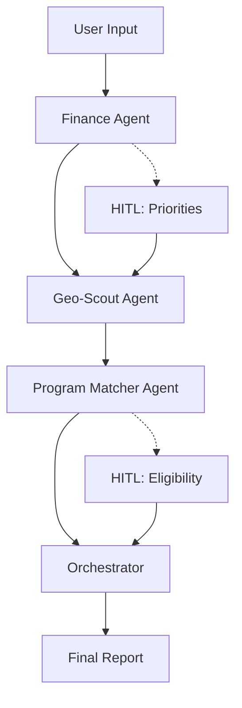

# Homebuyer MVP: Core Flow

_Multi-agent homebuyer assistance system with financial analysis and neighborhood matching._  
⚠️ **Disclaimer: This project is for educational purposes only. It does not provide financial advice.**

---

## Architecture Overview

This project follows a **multi-agent pipeline architecture**.

- **Three specialized agents** working sequentially
- **Human-in-the-loop (HITL)** confirmation at critical decision points
- **JSON-structured outputs** for each agent stage
- **Caching strategy** for performance optimization
- **Neighborhood-focused MVP** (listings integration in future phases)

---

## Agent Pipeline

Each agent has a clear role and defined scope:

- **Finance Agent** – computes housing affordability and payment breakdown
- **Geo-Scout Agent** – finds neighborhoods within budget, evaluates quality of life
- **Program Matcher Agent** – identifies eligible assistance programs and loans
- **Synthesizer LLM** – combines outputs into actionable recommendations

---

## Core Workflow



---

## Agent Specifications

### Finance Agent

**Input:** Income, debt, credit score, savings, expenses  
**Output:** `{max_home_price, monthly_payment, readiness_score}`  
**Rule:** Housing cost ≤ 30% of gross income  
**Cache:** Profiles by (income, debt, savings, credit score)

### Geo-Scout Agent

**Input:** Budget from Finance Agent, target city, user priorities (HITL)  
**Output:** `[{zip, median_home_value, school_rating, transit_score, safety_index}]`  
**Rule:** All median home values ≤ Finance Agent's max  
**Cache:** Median home values per ZIP

### Program Matcher Agent

**Input:** Location, income vs AMI, buyer status  
**Output:** `[{name, eligibility, benefit}]`  
**Rule:** Must match profile, no hallucinated programs  
**Cache:** Programs by AMI bracket + state  
**HITL:** User confirms eligibility before recommendations

---

## Repository Structure

This repository is organized to support **containerized agents** and **MCP servers**.

```text
.
├── README.md
├── CONTRIBUTING.md
├── .env
├── .gitignore
├── requirements.txt
├── docker-compose.yml
├── pyproject.toml
├── poetry.lock
├── main.py                  # Entrypoint for agent container
├── Dockerfile               # Agent container build
│
├── agents/                  # LangGraph agent implementations
│   └── finance_agent/
│       ├── __init__.py
│       ├── graph.py
│       ├── nodes.py
│       ├── prompts.py
│       ├── router.py
│       └── state.py
│   └── geoscout_agent/
│       ├── __init__.py
│       ├── graph.py
│       ├── nodes.py
│       ├── prompts.py
│       ├── router.py
│       └── state.py
│   └── program_agent/
│       ├── __init__.py
│       ├── graph.py
│       ├── nodes.py
│       ├── prompts.py
│       ├── router.py
│       └── state.py
│
├── mcp_servers/            # One subdir = one MCP server container
│   └── servers/
│       └── server_name/
│           ├── __init__.py
│           ├── client.py    # MCP client
│           ├── server.py    # MCP tool definitions
│           ├── Dockerfile   # Container spec for this MCP server
│           └── requirements.txt
│
├── tests/                   # Pytest-based testing
│   ├── __init__.py
│   ├── conftest.py
│   ├── test_mcp_client.py
│   ├── test_mcp_server.py
│   └── fixtures/
│
└── utilities/               # Shared helper code
    ├── __init__.py
    └── helpers.py
```

---

## Configuration

```python
# Credit score ranges (deterministic)
CREDIT_RANGES = {
    "exceptional": range(800,850),
    "very good": range(740,799),
    "good": range(670,739),
    "fair": range(580,669),
    "poor": range(300,579),
}

# Financial rules
MAX_HOUSING_RATIO = 0.30  # 30% of gross income
MIN_READINESS_SCORE = 0.6
```

---

## Development Principles

- **Sequential agent processing** with clear handoffs
- **HITL strategically placed** for user engagement and accuracy
- **Deterministic calculations** where possible (credit scores, ratios)
- **Comprehensive caching** for performance
- **Validation checks** prevent hallucinated or mismatched outputs

---

## Future Phases

- [ ] Direct listing integration (Redfin/Zillow APIs)
- [ ] "Ready to buy" vs "browsing" user workflows
- [ ] Real-time program eligibility updates
- [ ] Enhanced neighborhood scoring algorithms

---

## The Challenge

```text
"By the age of 30, only about 42 percent of millennials owned a home. That compares to 48 percent of Generation X and 51 percent of Baby Boomers."
The American Dream of homeownership feels increasingly out of reach. First-time buyers face mounting challenges: crushing debt loads, skyrocketing housing costs, and a maze of confusing assistance programs they don't even know exist.
MAREA (Multi-Agent Real Estate Assistant) is designed specifically for first-time homebuyers who need clear, actionable guidance to navigate the complex path to homeownership. Our multi-agent system cuts through the confusion by analyzing your financial readiness, identifying affordable neighborhoods, and matching you with assistance programs you actually qualify for.
```

---

# Langsmith integration
Successfully integrated LangSmith monitoring into the MCP Agent.
Environment variables (LANGSMITH_API_KEY, LANGSMITH_TRACING, LANGSMITH_PROJECT) are loaded via creds.env and passed to the agent in Docker.
Verified end-to-end tracing by running a test prompt (Hello, are you connected to LangSmith?) and confirming the run appears in the LangSmith dashboard under project civic-assistant-team-5.
Traces show inputs, outputs, token usage, latency, and model metadata.
This enables full observability of LLM calls for debugging, optimization, and cost tracking.
Next Steps:
Add more detailed traces for MCP client-server interactions (e.g., get_mcp_data() calls).
Configure dashboards/alerts in LangSmith if required by the team.

