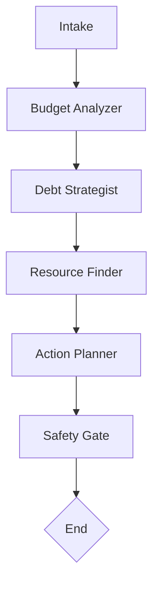

# Civic AI: Debt & Budget Assistant

_Educational multi-agent assistant built with LangGraph and MCP._  
⚠️ **Disclaimer: This project is for educational purposes only. It does not provide financial advice.**

---

## Architecture Overview

This project follows a **modular multi-agent architecture**.

- **One agent = one task**
- **One tool (MCP) = one function**
- Agents communicate through **A2A structured messages**
- Workflow is orchestrated with **LangGraph**

---

## Agents (Planned)

Each agent has a clear role and limited scope:

- **Intake Agent** – gathers initial user input and context
- **Budget Analyzer** – classifies income/expenses, computes savings rates
- **Debt Strategist** – compares payoff strategies (e.g., snowball vs avalanche)
- **Resource Finder** – looks up nonprofit, government, or housing programs
- **Action Planner** – generates neutral scripts/plans (e.g., creditor calls)
- **Safety Gate** – enforces disclaimers, checks outputs for compliance

---

## MCP Tools (Planned)

Each tool serves a **single, well-defined function**. Example draft tools:

- `apr_calc` – compute payoff timelines given balance, APR, and payments
- `spend_classifier` – categorize expenses into buckets (housing, food, etc.)
- `resource_lookup` – retrieve structured info on nonprofit/gov programs

_(More tools will be added as agents are refined.)_

---

## LangGraph Workflow

**Workflow Skeleton (to be updated as design evolves):**

