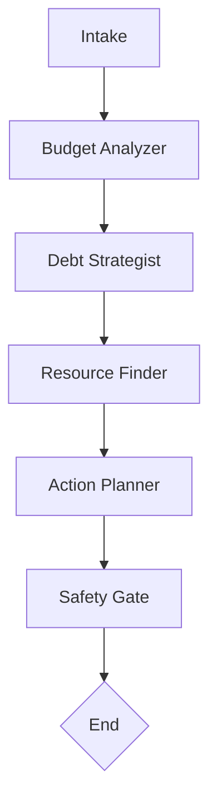

# Civic AI: Debt & Budget Assistant

_Educational multi-agent assistant built with LangGraph and MCP._  
⚠️ **Disclaimer: This project is for educational purposes only. It does not provide financial advice.**

---

## Architecture Overview

This project follows a **modular multi-agent architecture**.

- **One agent = one task**
- **One tool (MCP) = one function**
- Agents communicate through **A2A structured messages**
- Workflow is orchestrated with **LangGraph**

---

## Agents (Planned)

Each agent has a clear role and limited scope:

- **Intake Agent** – gathers initial user input and context
- **Budget Analyzer** – classifies income/expenses, computes savings rates
- **Debt Strategist** – compares payoff strategies (e.g., snowball vs avalanche)
- **Resource Finder** – looks up nonprofit, government, or housing programs
- **Action Planner** – generates neutral scripts/plans (e.g., creditor calls)
- **Safety Gate** – enforces disclaimers, checks outputs for compliance

---

## MCP Tools (Planned)

Each tool serves a **single, well-defined function**. Example draft tools:

- `apr_calc` – compute payoff timelines given balance, APR, and payments
- `spend_classifier` – categorize expenses into buckets (housing, food, etc.)
- `resource_lookup` – retrieve structured info on nonprofit/gov programs

### More tools will be added as agents are refined

---

## LangGraph Workflow

**Workflow Skeleton (to be updated as design evolves):**



---

## Repository Structure

This repository is organized to support a modular **multi-agent workflow** (built with LangGraph) and **tool integration** via MCP servers.

```text
.
├── README.md
├── CONTRIBUTING.md
├── creds.env
├── .gitignore
├── requirements.txt
├── Dockerfile
├── docker-compose.yml
├── agents/
│   └── agent_name/
│       ├── __init__.py
│       ├── graph.py
│       ├── nodes.py
│       ├── prompts.py
│       ├── router.py
│       └── state.py
├── mcp_services/
│   ├── __init__.py
│   ├── client.py
│   └── servers/
│       └── server_name/
│           ├── __init__.py
│           └── Dockerfile
│           └── requirements.txt
│           └── server.py
├── tests/
│   ├── __init__.py
│   ├── conftest.py
│   └── fixtures/
└── utilities/
    ├── __init__.py
    └── helpers.py
```

### Top-Level Files

- **`README.md`** – Project overview, setup instructions, and documentation.
- **`requirements.txt`** – Python dependencies required for running the project.

### Agents (`/agents/`)

Each subdirectory represents an **AI agent** with its own workflow logic.

- **`graph.py`** – Defines the LangGraph state machine for the agent.
- **`nodes.py`** – Implements the functional nodes that process state transitions.
- **`prompts.py`** – Centralized storage of LLM prompt templates.
- **`router.py`** – Logic for dynamically routing the conversation flow within the agent.
- **`state.py`** – Defines the schema and data model for the agent’s workflow state.

> Agents communicate with each other using **A2A (Agent-to-Agent) messaging**.

### MCP (`/mcp/`)

Implements **Model Context Protocol (MCP)** clients and servers for tool integration.

- **`client.py`** – Client for invoking MCP tools inside workflows.
- **`servers/`** – Each subdirectory hosts an MCP tool server.
  - **`server.py`** – Tool definitions and execution logic for that server.

### Tests (`/tests/`)

Testing infrastructure to validate correctness and safety.

- **`conftest.py`** – Pytest configuration and fixtures.
- **`fixtures/`** – Predefined input/output scenarios for reproducible tests.

### Utilities (`/utilities/`)

Shared helper code used across agents and orchestration.

- **`helpers.py`** – Utility functions (e.g., logging wrappers, validation, formatting).

---

## This structure ensures that:

- Agents remain **modular** and **composable**.
- Tools are **decoupled** via MCP servers.
- Tests and utilities are **centralized** for reuse and consistency.
